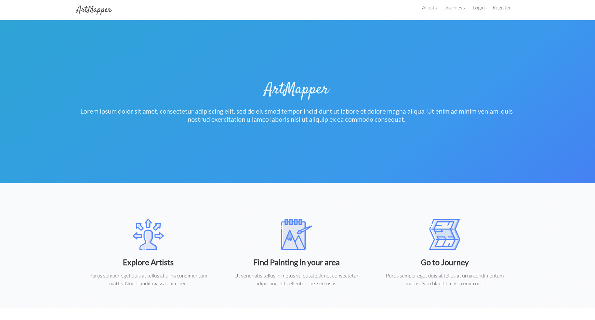

# Artmapper

A full-stack MERN app created with MongoDB, Express, React and Node.js created with my General Assembly colloegues James and Aviv.

## Objective

* To create an app able to handle user registrations and logins
* To help the app users track and upload their favourite paintings and artists
* To create a project collaborating with other developers

## Landing page

## Links

[Artmapper](https://art-mapper.herokuapp.com)

